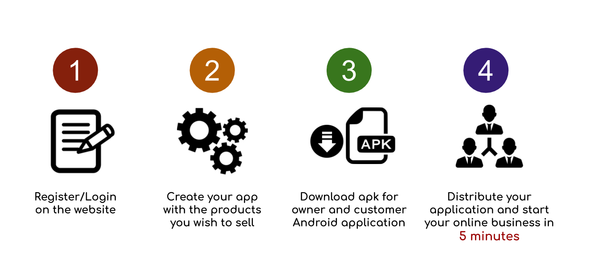
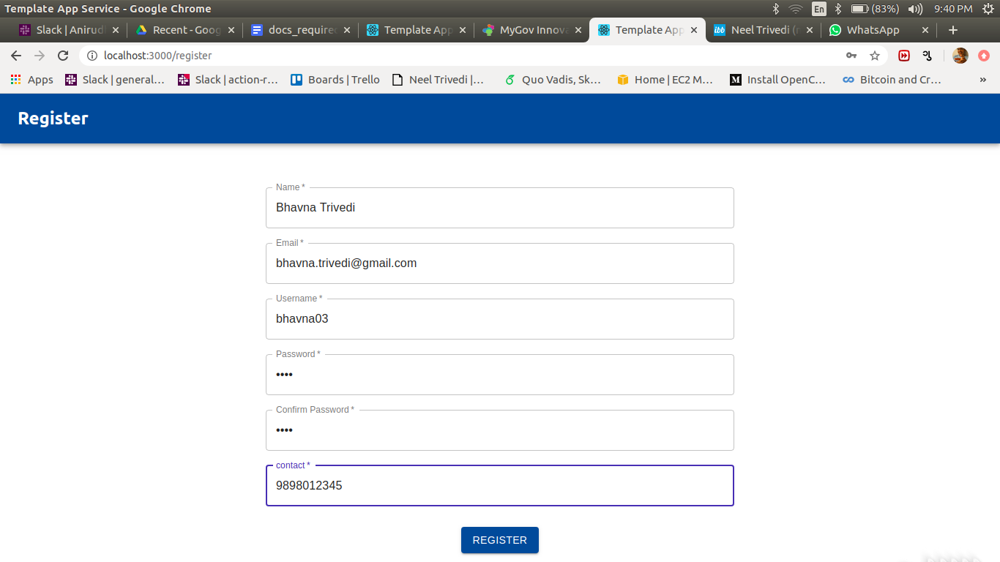
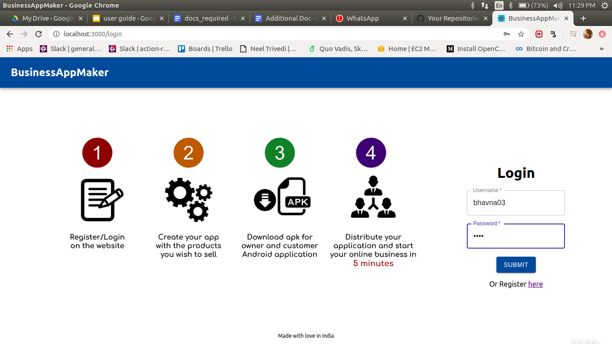
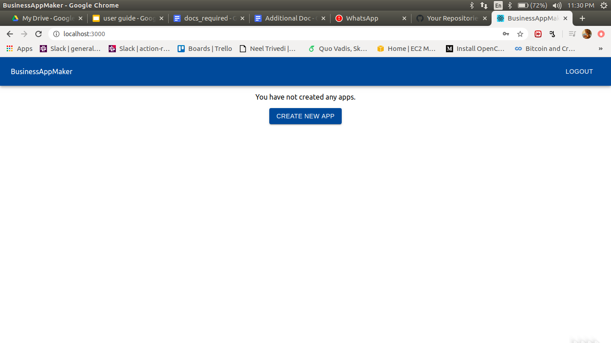
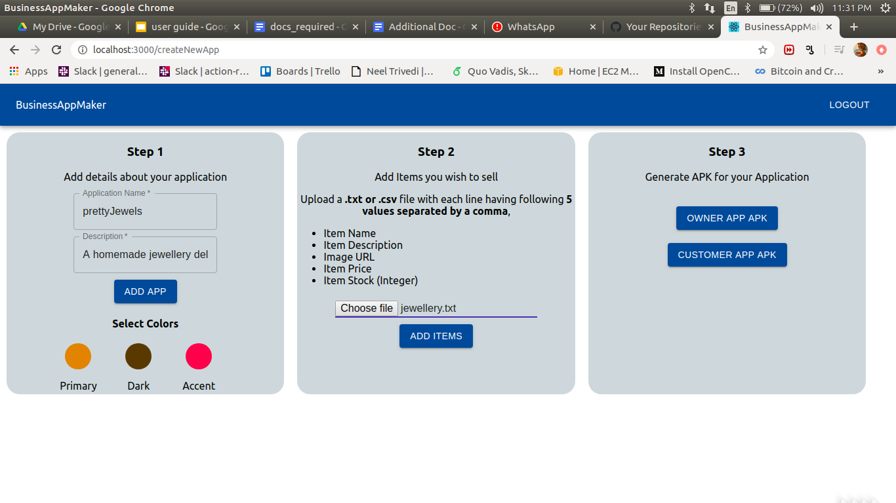
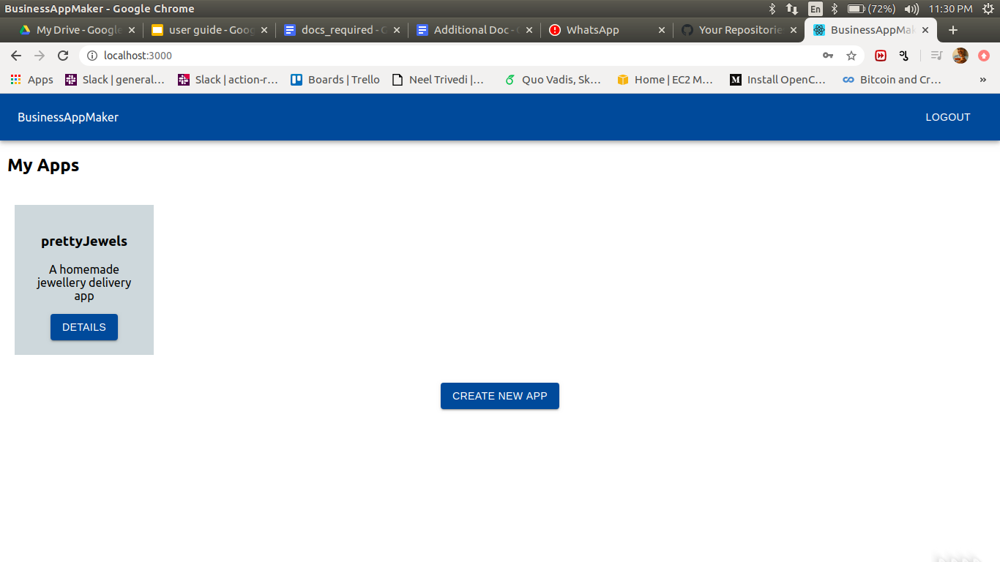
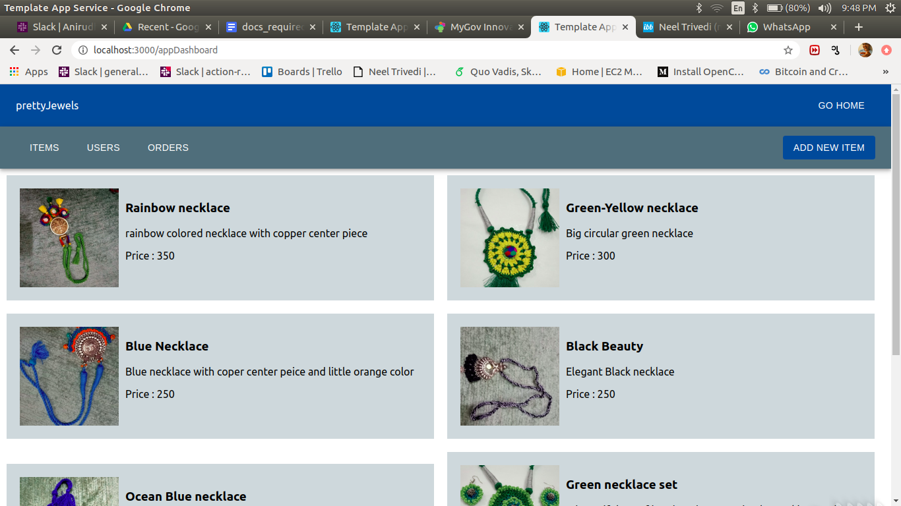
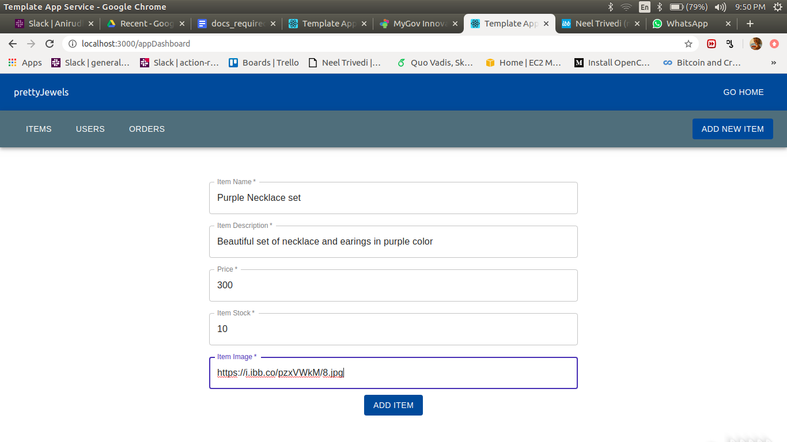
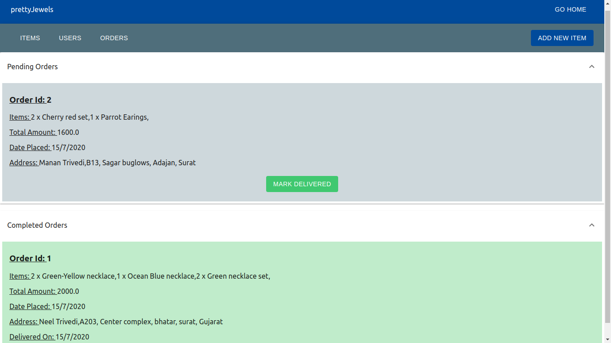
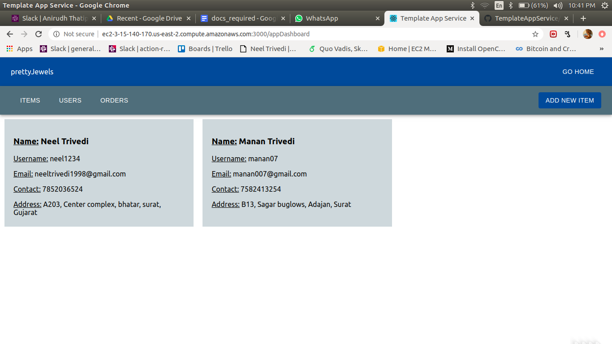

# Business App Maker



- This platform will enable small home-run business owners to create their
personal Android application for online trading within minutes.
- With this platform owners can easily add the items they wish to sell through
web dashboard or owner android application. And those items will be visible
to their customers through customer android application.
- In a way, this platform will enable business owners to start their online trade
within minutes and with only few button clicks freeing them from trouble and
high costs of hiring app development agencies to create their applications.

### Major Components of the System

- There are 3 major components in this system:
  - [Web Dashboard](https://github.com/neel1998/TemplateAppService)
  - [Owner Android application](https://github.com/neel1998/TemplateOwnerApp)
  - [Customer Android application](https://github.com/neel1998/TemplateCustomerApp)
- All these three components are synced with each other through a backend server.

<hr/>

## Features of the Web Dashboard


### Login / register

As a first step, the users(business owners) must register themselves with the service and create their login credentials. Once registered, users can use their credentials to log into their dashboards.





<hr/>

### Dashboard


Initially, when the user logs in for the first time, the home page will be blank since now application has been created so far. User can click on the <b>Create New App</b> button to start creating a new application.



<hr/>

### Create Application Panel

This panel is the main component of the system. Here user is provided with three simple steps to create their applications.



#### Step 1 (Register the application)

In this step user has to provide a name and description for the application they wish to create. User can customize the colors of the application as well to give it more personal look.

#### Step 2 (Add Items)

In this step, user has to upload a simple CSV file containing the details about the items to be sold using the application. A sample of such file can be found [here](./jewellery.txt)

#### Step 3 (Generate APKs)

In this last step, user just has to generate APKs for the owened and customer android application using just a single button click and their personalized android applications are ready to use for online trading.

<hr/>

### Updated Dashboard

Once user has created an application, that application will be visible on the main dashboard. From here, user can track all the orders and delivery status, by clicking on the <b>Details</b> button.



<hr/>

### Appliction Dashboard

For each of the application created by the user, a separate dashbord will be created. In this dashboard, there will be three tabs as exaplined below:

#### Application Dashboard (Items):

In this tab user can see the details about the items which were added during the second step of the application creation. User can easiy update this list and add new items as per the requirements.





#### Application Dashboard (Orders):

In this tab, business owner can keep track of current and past orders. Once any order is delivered, owned can mark that order as "delivered".



#### Application Dashboard (Users):

In this tab, business owner can see the list of user who have registered to this application using the customer android app distributed by the owner.



<hr/>

# Run the system on your Machine

To run the system on your personal machine locally, first make sure both [Owner Android application](https://github.com/neel1998/TemplateOwnerApp) and [Customer Android application](https://github.com/neel1998/TemplateCustomerApp) are setup on your system.

After cloning this repository, make the following changes:

- In, ```expressServer/src/Routes/appPath.js``` update the paths of the owner and customer android application code as per your system.

- In ```expressServer/src/appDatabase.js``` and ```expressServer/src/mainDatabase.js``` change the ```mainPath``` variable based on the location at which you have cloned this repo.

- In ```react-client/src/constants.js``` change the ```baseURL``` variable to your localhost IP address.

After making these changes, run following commands in ```./expressServer/``` and in ```./react-client/```

```
npm install
sudo npm start
```
